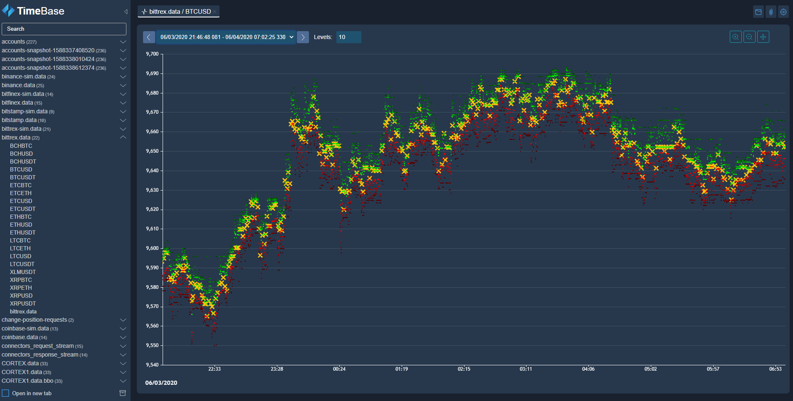

# TimeBase Web Gateway and Administrator

## Overview 



**TimeBase Administrator** offers a simple and powerful web interface to manage and monitor data stored in TimeBase:

* Create/Edit/View/Delete/Export/Import streams.
* Monitor live data.
* Query/Export/Import data.

> Refer to [TimeBase Documentation](https://kb.timebase.info/admin.html).

TimeBase Administrator also serves as a **REST/WS gateway for TimeBase Server**. 

> Refer to [TimeBase REST/WS API reference](https://webadmin.timebase.info/api/v0/docs/index.html).

## How to Build

### Requirements

* **[Oracle JDK 11](https://docs.oracle.com/javase/11/docs/technotes/guides/install/install_overview.html)** or **[Open JDK 11](https://adoptopenjdk.net/)**
* **[Docker engine](https://docs.docker.com/engine/installation/)** (Optional) to build Docker images locally

1. Build project:
    ```./gradlew clean build```   
    
2. Build docker image locally:
    ``` ./gradlew dockerBuildImage```

## Quick Start 

1. [Start TimeBase Server](https://kb.timebase.info/community/overview/quick-start)
```bash
docker run --rm -d \ 
   -p 8011:8011 \ 
   --name=timebase-server \ 
   --ulimit nofile=65536:65536 \ 
   finos/timebase-ce-server:6.1
```
2. Run Docker container with [TimeBase WS Server](https://hub.docker.com/r/epam/timebase-ws-server)

```bash
docker run --rm -d \ 
   --name timebase-admin \
    --link timebase-server:timebase \ 
   -p 8099:8099 \ 
   -e "JAVA_OPTS=-Dtimebase.url=dxtick://timebase:8011" \
    --ulimit nofile=65536:65536 \
   epam/timebase-ws-server:0.5
```
or start server from command line

```
./gradlew bootRun
```

## Deployment 

> Refer to [Deployment](https://github.com/epam/TimebaseWS/tree/main/guide/deployment.md).

## Configuration 

> Refer to [Configuration](https://github.com/epam/TimebaseWS/tree/main/guide/configurations.md).

## Authentication 

> Refer to [Authentication](https://github.com/epam/TimebaseWS/tree/main/guide/authentication/auth-intro.md).

## Authorization 

> Refer to [Authorization](https://github.com/epam/TimebaseWS/tree/main/guide/authorization/authorization.md).

