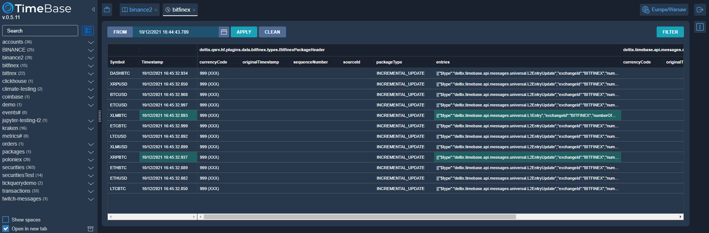

# TimeBase Web Gateway and Administrator

## Overview 



**TimeBase Administrator** offers a simple and powerful web interface to manage and monitor data stored in TimeBase:

* Create/Edit/View/Delete/Export/Import streams.
* Monitor live data.
* Query/Export/Import data.

> Refer to [TimeBase Documentation](https://kb.timebase.info/admin.html).

TimeBase Administrator also serves as a **REST/WS gateway for TimeBase Server**. 

> Refer to [TimeBase REST/WS API reference](https://docs.deltixhub.com/timebase-api/).

## Quick Start 

1. [Start TimeBase Server](https://kb.timebase.info/quick-start.html)
2. Run Docker container with [TimeBase WS Server](https://hub.docker.com/r/epam/timebase-ws-server)

```bash
docker run --rm -d \ 
    --name timebase-admin \ 
    -p 8099:8099 \ 
    -e "JAVA_OPTS=-Dtimebase.url=dxtick://HOST_PORT" \
    epam/timebase-ws-server:latest
```

## Deployment 

> Refer to [Deployment](https://github.com/epam/TimebaseWS/tree/intro/guide/deployment.md).

## Configuration 

> Refer to [Configuration](https://github.com/epam/TimebaseWS/tree/intro/guide/configurations.md).

## Authentication 

> Refer to [Authentication](https://github.com/epam/TimebaseWS/tree/intro/guide/authentication.md).
