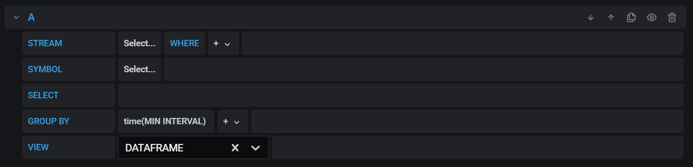
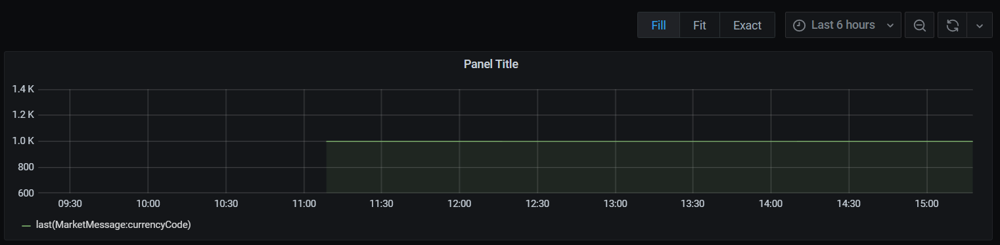
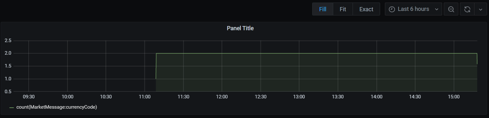
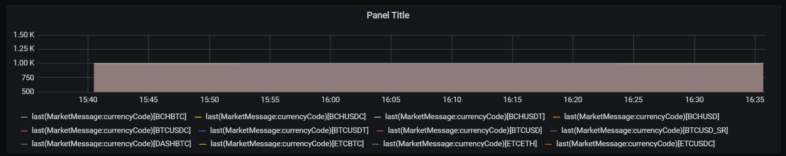
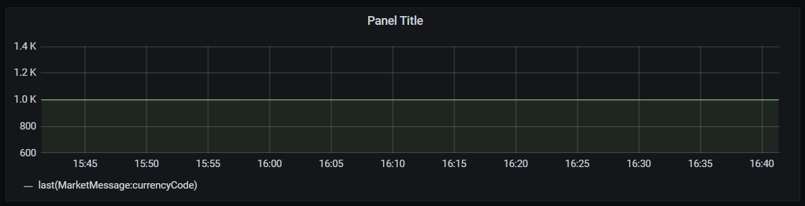
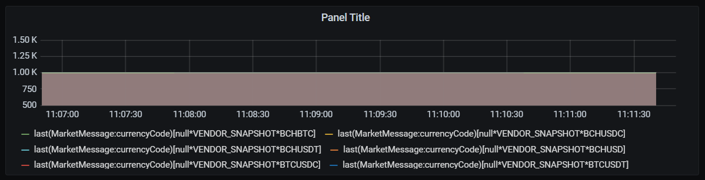
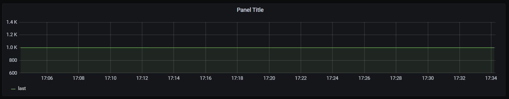

# Grafana Test-Cases

[TC01. Check database select](#tc01-check-database-select)                     
[TC02. Check Stream dropdown](#tc02-check-stream-dropdown)           
[TC03. Check Stream tooltip](#tc03-check-stream-tooltip)                     
[TC04. Check search for Stream dropdown](#tc04-check-search-for-stream-dropdown)          
[TC05. Check changing of Stream](#tc05-check-changing-of-stream)       
[TC06. Check finding non-existent Stream](#tc06-check-finding-non-existent-stream)            
[TC07. Check Symbol dropdown](#tc07-check-symbol-dropdown)        
[TC08. Check search for Symbol dropdown](#tc08-check-search-for-symbol-dropdown)      
[TC09. Check Symbol tooltip](#tc09-check-symbol-tooltip)                        
[TC10. Check changing of Symbol](#tc10-check-changing-of-symbol)        
[TC11. Check finding non-existent Symbol](#tc11-check-finding-non-existent-symbol)        
[TC12. Check Symbol when changing Stream](#tc12-check-symbol-when-changing-stream)            
[TC13. Check Select control](#tc13-check-select-control)          
[TC14. Check Fields control](#tc14-check-fields-control)      
[TC15. Check Functions control](#tc15-check-functions-control)   
[TC16. Check Fields select](#tc16-check-fields-select)         
[TC17. Check changing of Field](#tc17-check-changing-of-field)              
[TC18. Check decimalmath functions select](#tc18-check-decimalmath-functions-select)        
[TC19. Check doublemath functions select](#tc19-check-doublemath-functions-select)          
[TC20. Check finance functions select](#tc20-check-finance-functions-select)        
[TC21. Check statistics functions select](#tc21-check-statistics-functions-select)         
[TC22. Check cma function tooltip](#tc22-check-cma-function-tooltip)        
[TC23. Check atr function tooltip](#tc23-check-atr-function-tooltip)   
[TC24. Check removing field](#tc24-check-removing-field)     
[TC25. Check removing function](#tc25-check-removing-function)        
[TC26. Check functions parameters](#tc26-check-functions-parameters)    
[TC27. Check changing aggregation](#tc27-check-changing-aggregation)        
[TC28. Check validation for quantile aggregation](#tc28-check-validation-for-quantile-aggregation)         
[TC29. Check time grouping](#tc29-check-time-grouping)       
[TC30. Check changing global interval](#tc30-check-changing-global-interval)          
[TC31. Check changing global interval for saved dashboard](#tc31-check-changing-global-interval-for-saved-dashboard)     
[TC32. Check adding Group by field](#tc32-check-adding-group-by-field)      
[TC33. Check Option control](#tc33-check-option-control)      
[TC34. Check changing Group by field](#tc34-check-changing-group-by-field)       
[TC35. Check removing Group by field](#tc35-check-removing-group-by-field)      
[TC36. Check adding multiple Group by field](#tc36-check-adding-multiple-group-by-field)      
[TC37. Check changing multiple Group by field](#tc37-check-changing-multiple-group-by-field)      
[TC38. Check Group by field when changing Stream](#tc38-check-group-by-field-when-changing-stream)       
[TC39. Check Select when changing Stream](#tc38-check-select-when-changing-stream)     
[TC40. Check adding alias](#tc40-check-adding-alias)   
[TC41. Check changing alias](#tc41-check-changing-alias)        
[TC42. Check adding multiple alias](#tc42-check-adding-multiple-alias)       

### TC01. Check database select

_**Test Steps:**_
1. Go to https://grafana.staging.deltixhub.io/.
2. Select `TimeBaseCC` database.
3. Make sure database is selected and the following empty query is displayed:      
    
4. Check that **Select...** is displayed for `Stream` and `Symbol`.

_**Result:**_ Pass

### TC02. Check Stream dropdown

_**Test Steps:**_
1. Go to https://grafana.staging.deltixhub.io/.
2. Select `TimeBaseCC` database.
3. Click on the `Stream` dropdown.
4. Check that the list of streams is displayed.
5. Select **CORTEX.data** stream.

_**Result:**_ Pass

### TC03. Check Stream tooltip

_**Test Steps:**_
1. Go to https://grafana.staging.deltixhub.io/.
2. Select `TimeBaseCC` database.
3. Click on the `Stream` dropdown.
4. Select **CORTEX.data** stream.
5. Hover over the stream.
6. Make sure the tooltip is displayed.  

_**Result:**_ Pass

### TC04. Check search for Stream dropdown

_**Test Steps:**_
1. Go to https://grafana.staging.deltixhub.io/.
2. Select `TimeBaseCC` database.
3. Click on the `Stream` dropdown.
4. Check that the list of streams is displayed.
5. Type **data** in the textbox.
6. Make sure that the list of streams contains **data**.

_**Result:**_ Pass

### TC05. Check changing of Stream

_**Test Steps:**_
1. Go to https://grafana.staging.deltixhub.io/.
2. Select `TimeBaseCC` database.
3. Click on the `Stream` dropdown.
4. Check that the list of streams is displayed.
5. Select **CORTEX.data** stream.
6. Click on the dropdown again.
7. Check that dropdown is cleared and the list of streams is displayed.
8. Click on the empty area of the page.
9. Make sure that stream is set to **CORTEX.data** again.
10. Click on the dropdown. 
11. Select **CORTEX1.data.bbo** stream.
12. Make sure stream has been changed.

_**Result:**_ Pass

### TC06. Check finding non-existent stream

_**Test Steps:**_
1. Go to https://grafana.staging.deltixhub.io/.
2. Select `TimeBaseCC` database.
3. Click on the `Stream` dropdown.
4. Input `aaa` into the textbox.
5. Make sure `No options` is displayed.
6. Click `Enter`.
7. Make sure `No stream aaa` message is displayed.

_**Result:**_ Pass

### TC07. Check Symbol dropdown

_**Test Steps:**_
1. Go to https://grafana.staging.deltixhub.io/.
2. Select `TimeBaseCC` database.
3. Click on the `Symbol` dropdown.
4. Make sure `No options` is displayed.
5. Click on the `Streams` dropdown and select **CORTEX.data**.
6. Make sure **ALL()** is displayed for `Symbol`.

_**Result:**_ Pass

### TC08. Check search for Symbol dropdown

_**Test Steps:**_
1. Go to https://grafana.staging.deltixhub.io/.
2. Select `TimeBaseCC` database.
3. Select `CORTEX.data` stream.
4. Type **BCHBTC** in the textbox.
5. Make sure that the list of streams contains **BCHBTC**.

_**Result:**_ Pass

### TC09. Check Symbol tooltip

_**Test Steps:**_
1. Go to https://grafana.staging.deltixhub.io/.
2. Select `TimeBaseCC` database.
3. Click on the `Stream` dropdown.
4. Select **CORTEX.data** stream and **BCHUSD** symbol.
5. Hover over the symbol
6. Make sure the tooltip is displayed.  

_**Result:**_ Pass

### TC10. Check changing of Symbol

_**Test Steps:**_
1. Go to https://grafana.staging.deltixhub.io/.
2. Select `TimeBaseCC` database.
3. Select `CORTEX.data` stream.
4. Click on the `Symbol` dropdown.
5. Check that the list of symbols is displayed.
6. Select **BCHBTC** symbol
7. Click on the dropdown again.
8. Check that dropdown is cleared and the list of symbols is displayed.
9. Click on the empty area of the page.
10. Make sure that symbol is set to **BCHBTC** again.
11. Click on the dropdown. 
12. Select **BCHUSD** stream.
13. Make sure symbol has been changed.

_**Result:**_ Pass

### TC11. Check finding non-existent Symbol

_**Test Steps:**_
1. Go to https://grafana.staging.deltixhub.io/.
2. Select `TimeBaseCC` database.
3. Click on the `Symbol` dropdown.
4. Input `aaa` into the textbox.
5. Make sure `ALL()` is displayed.
6. Click `Enter`.
7. Make sure `No symbols [aaa] in CORTEX.data` message is displayed.

_**Result:**_ Pass

### TC12. Check Symbol when changing Stream

_**Test Steps:**_
1. Go to https://grafana.staging.deltixhub.io/.
2. Select `TimeBaseCC` database.
3. Choose **CORTEX.data** stream and **BCHBTC** symbol.
4. Change stream to **fifteen_minutes**.
5. Make sure `No symbols [BCHBTC] in fifteen_minutes` message is displayed.

_**Result:**_ Pass

### TC13. Check Select control

_**Test Steps:**_
1. Go to https://grafana.staging.deltixhub.io/.
2. Select `TimeBaseCC` database.
3. Choose **CORTEX.data** stream and **BCHBTC** symbol.
4. Check that **+** is displayed in `Select`.
5. Click on the **+**.
6. Make sure that **Fields >** and **Functions >** are displayed.

_**Result:**_ Pass

### TC14. Check Fields control

_**Test Steps:**_
1. Go to https://grafana.staging.deltixhub.io/.
2. Select `TimeBaseCC` database.
3. Choose **CORTEX.data** stream and **BCHBTC** symbol.
4. Check that **+** is displayed in `Select`.
5. Click on the **+**.
6. Click on **Fields >**.
7. Make sure that the list of fileds with their type is displayed.

_**Result:**_ Pass

### TC15. Check Functions control

_**Test Steps:**_
1. Go to https://grafana.staging.deltixhub.io/.
2. Select `TimeBaseCC` database.
3. Choose **CORTEX.data** stream and **BCHBTC** symbol.
4. Check that **+** is displayed in `Select`.
5. Click on the **+**.
6. Click on **Functions >**.
7. Make sure that the list of function groups is displayed:
   *  **decimalmath**
   *  **doublemath**
   *  **finance**
   *  **statistics**

_**Result:**_ Pass

### TC16. Check Fields select

_**Test Steps:**_
1. Go to https://grafana.staging.deltixhub.io/.
2. Select `TimeBaseCC` database.
3. Choose **CORTEX.data** stream and **BCHBTC** symbol.
4. Check that **+** is displayed in `Select`.
5. Click on the **+**.
6. Click on **Fields >**.
7. Select `PackageHeader : packageType`.
8. Make sure `PackageHeader : packageType` with field type is displayed. 

_**Result:**_ Pass

### TC17. Check changing of Field

_**Test Steps:**_
1. Go to https://grafana.staging.deltixhub.io/.
2. Select `TimeBaseCC` database.
3. Choose **CORTEX.data** stream and **BCHBTC** symbol.
4. Check that **+** is displayed in `Select`.
5. Click on the **+**.
6. Click on **Fields >**.
7. Select `PackageHeader : packageType` field.
8. Click on the dropdown again.
9. Check that the list of function groups is displayed.
10. Click on the empty area of the page.
11. Make sure that symbol is set to `PackageHeader : packageType` again.
12. Click on the dropdown. 
13. Make sure `Change` dropdown is displayed with the list of fields and `Remove` option.
14. Select `MarketMessage : currencyCode` field.
15. Make sure field has been changed.

_**Result:**_ Pass

### TC18. Check decimalmath functions select

_**Test Steps:**_
1. Go to https://grafana.staging.deltixhub.io/.
2. Select `TimeBaseCC` database.
3. Choose **CORTEX.data** stream and **BCHBTC** symbol.
4. Check that **+** is displayed in `Select`.
5. Click on the **+**.
6. Click on **Functions >**.
7. Select `decimalmath` and check `divide`. 
8. Make sure `divide(select..., select...)` is displayed.
9. Click on the 1st `select...`.
10. Check that **Fields >** and **Functions >** are displayed.
11. Click on the 2nd `select...`.
12. Check that **Fields >** and **Functions >** are displayed. 

_**Result:**_ Pass

### TC19. Check doublemath functions select

_**Test Steps:**_
1. Go to https://grafana.staging.deltixhub.io/.
2. Select `TimeBaseCC` database.
3. Choose **CORTEX.data** stream and **BCHBTC** symbol.
4. Check that **+** is displayed in `Select`.
5. Click on the **+**.
6. Click on **Functions >**.
7. Select `doublemath` and check `divide`. 
8. Make sure `divide(select..., select...)` is displayed.

_**Result:**_ Pass

### TC20. Check finance functions select

_**Test Steps:**_
1. Go to https://grafana.staging.deltixhub.io/.
2. Select `TimeBaseCC` database.
3. Choose **CORTEX.data** stream and **BCHBTC** symbol.
4. Check that **+** is displayed in `Select`.
5. Click on the **+**.
6. Click on **Functions >**.
7. Select `finance` and check `atr`. 
8. Make sure `atr(select..., select..., select..., 14)` is displayed.

_**Result:**_ Pass

### TC21. Check statistics functions select

_**Test Steps:**_
1. Go to https://grafana.staging.deltixhub.io/.
2. Select `TimeBaseCC` database.
3. Choose **CORTEX.data** stream and **BCHBTC** symbol.
4. Check that **+** is displayed in `Select`.
5. Click on the **+**.
6. Click on **Functions >**.
7. Select `statistics` and check `cma`. 
8. Make sure `cma(select...)` is displayed.

_**Result:**_ Pass

### TC22. Check cma function tooltip

_**Test Steps:**_
1. Go to https://grafana.staging.deltixhub.io/.
2. Select `TimeBaseCC` database.
3. Choose **CORTEX.data** stream and **BCHBTC** symbol.
4. Check that **+** is displayed in `Select`.
5. Click on the **+**.
6. Click on **Functions >**.
7. Select `statistics` and check `cma`. 
8. Make sure `cma(select...)` is displayed.
9. Hover over `select...`.
10. Make sure `field : LONG | INT | SHORT | BYTE | FLOAT | DECIMAL | DECIMAL64` is displayed.

_**Result:**_ Pass

### TC23. Check atr function tooltip

_**Test Steps:**_
1. Go to https://grafana.staging.deltixhub.io/.
2. Select `TimeBaseCC` database.
3. Choose **CORTEX.data** stream and **BCHBTC** symbol.
4. Check that **+** is displayed in `Select`.
5. Click on the **+**.
6. Click on **Functions >**.
7. Select `finance` and check `atr`. 
8. Make sure `atr(select..., select..., select..., 14)` is displayed.
9. Hover over the 1st `select...`.
10. Make sure `high : LONG | INT | SHORT | BYTE | FLOAT | DECIMAL | DECIMAL64` is displayed.
11. Hover over the 2nd `select...`.
12. Make sure `low : LONG | INT | SHORT | BYTE | FLOAT | DECIMAL | DECIMAL64` is displayed.
13. Hover over the 3rd `select...`.
14. Make sure `close : LONG | INT | SHORT | BYTE | FLOAT | DECIMAL | DECIMAL64` is displayed.
15. Hover over 14.
16. Check that `period : INT32` is displayed.

_**Result:**_ Pass

### TC24. Check removing field

_**Test Steps:**_
1. Go to https://grafana.staging.deltixhub.io/.
2. Select `TimeBaseCC` database.
3. Choose **CORTEX.data** stream and **BCHBTC** symbol.
4. Check that **+** is displayed in `Select`.
5. Click on the **+**.
6. Click on **Fields >**.
7. Select `PackageHeader : packageType`.
8. Click on the field.
9. Select `Remove`.
10. Check that field has been removed.

_**Result:**_ Pass

### TC25. Check removing function

_**Test Steps:**_
1. Go to https://grafana.staging.deltixhub.io/.
2. Select `TimeBaseCC` database.
3. Choose **CORTEX.data** stream and **BCHBTC** symbol.
4. Check that **+** is displayed in `Select`.
5. Click on the **+**.
6. Click on **Functions >**.
7. Select `decimalmath` and check `mean`.
8. Click on the function.
9. Select `Remove`.
10. Check that field has been removed.

_**Result:**_ Pass

### TC26. Check functions parameters

_**Test Steps:**_
1. Go to https://grafana.staging.deltixhub.io/.
2. Select `TimeBaseCC` database.
3. Choose **CORTEX.data** stream and **BCHBTC** symbol.
4. Check that **+** is displayed in `Select`.
5. Click on the **+**.
6. Click on **Functions >**.
7. Select `decimalmath` and check `mean`.
8. Click on the 1st `select...`.
9.  Make sure that **Fields >** and **Functions >** are displayed.
10. Select **Functions >** and check `divide` function.
11. Check that function is inserted.
12. Click on the 2nd `select...`.
13. Make sure that **Fields >** and **Functions >** are displayed.
14. Select **Fields >** and check `MarketMessage : currencyCode` field.
15. Check that field is inserted.
16. Click on `select...` of the `divide` function and select `MarketMessage : currencyCode` field.
17. Check that:
   *  chart is displayed
   *  `last` aggregation is selected by default

_**Result:**_ Pass

### TC27. Check changing aggregation

_**Test Steps:**_
1. Go to https://grafana.staging.deltixhub.io/.
2. Select `TimeBaseCC` database.
3. Choose **CORTEX.data** stream and **BCHBTC** symbol.
4. Check that **+** is displayed in `Select`.
5. Click on the **+** -> **Functions >**.
6. Select `MarketMessage : currencyCode` field.
7. Check that `last` aggregation is applied.      
    
8. Click on `last`.
9. Make sure `Change` with the list of aggregations is displayed:
   *  **count**
   *  **cumsum**
   *  **first**
   *  **max**
   *  **mean**
   *  **median**
   *  **min**
   *  **quantile**
   *  **sum**
10. Change `last` to `count`.
11. Check that `last` is changed to `count` in the query and in the chart.      
    

_**Result:**_ Pass

### TC28. Check validation for quantile aggregation

_**Test Steps:**_
1. Go to https://grafana.staging.deltixhub.io/.
2. Select `TimeBaseCC` database.
3. Choose **CORTEX.data** stream and **BCHBTC** symbol.
4. Check that **+** is displayed in `Select`.
5. Click on the **+** and select **Functions >**.
6. Select `MarketMessage : currencyCode` field.
7. Add `quantile` aggregation.        
8. Check that period equals to `0.75` by default.
9. Change period to `10`.
10. Check that:
   *  `Max value 1` message is displayed
   *  chart shows `No data`
11. Change period to `-5`.
12. Make sure that:
   *  `Min value 0` message is displayed
   *  chart shows `No data`
13. Change period to `0`.
14. Make sure chart shows data.
15. Leave period cleared and press `Enter`.
16. Check that:
   *  `quantile(FLOAT64: quantile)` is displayed
   *  chart shows `No data`
17. Input text value (e.g.: aaa) as a period.
18. Check that:
   *  chart displays `No data`
   *  chart displays `Argument quantile: 'aaa' cannot be parsed to type 'FLOAT64'` message
   *  `Invalid value` message is displayed under the textbox

_**Result:**_ Pass

### TC29. Check time grouping

_**Test Steps:**_
1. Go to https://grafana.staging.deltixhub.io/.
2. Select `TimeBaseCC` database.
3. Choose **CORTEX.data** stream and **BCHBTC** symbol.
4. Check that **+** is displayed in `Select`.
5. Click on the **+** and select **Functions >**.
6. Select `MarketMessage : currencyCode` field.
7. Check that **Group by** is set to `time(MIN INTERVAL)`.
8. Change **Group by** to `10m`.
9. Check data in the chart are grouped by `10m`.
10. Repeat steps 8-10 for other **Group by** options:
   *  **30s**
   *  **1m**
   *  **30m**
   *  **1h**
   
_**Result:**_ Pass

### TC30. Check changing global interval

_**Test Steps:**_
1. Go to https://grafana.staging.deltixhub.io/.
2. Select `TimeBaseCC` database.
3. Choose **CORTEX.data** stream and **BCHBTC** symbol.
4. Check that **+** is displayed in `Select`.
5. Click on the **+** and select **Functions >**.
6. Select `MarketMessage: currencyCode` field.
7. Change **Group by** to `10m`.
8. Change global interval.
9. Make sure that:
   *  **Group by** is reset and its value set to `time(MIN INTERVAL)`
   *  `Selected grouping by time is reset due to time interval change` message is displayed

_**Result:**_ Pass

### TC31. Check changing global interval for saved dashboard

_**Test Steps:**_
1. Go to https://grafana.staging.deltixhub.io/.
2. Select `TimeBaseCC` database.
3. Choose **CORTEX.data** stream and **BCHBTC** symbol.
4. Check that **+** is displayed in `Select`.
5. Click on the **+** and select **Functions >**.
6. Select `MarketMessage : currencyCode` field.
7. Change **Group by** to `10m`.
8. Change **Group by** to `1m` and save the dashboard.
9. Change global interval.
10. Change view from Dataframe to Timeseries.
11. Check that:
  **Group by** is reset and its value set to `time(MIN INTERVAL)`
   *  `Selected grouping by time is reset due to time interval change` message is displayed

_**Result:**_ Pass

### TC32. Check adding Group by field

_**Test Steps:**_
1. Go to https://grafana.staging.deltixhub.io/.
2. Select `TimeBaseCC` database.
3. Choose **CORTEX.data** stream.
4. Select `MarketMessage: currencyCode` field.
5. Click on **+** of **Group by**.
6. Check that the list of fields is displyed.
7. Select `InstrumentMessage: Symbol`.
8. Make sure that:
   *  grouping is added
   *  data are grouped by symbol in the chart         
        
   *  an additional **Option** control set to `COLUMN` appears 

_**Result:**_ Pass

### TC33. Check Option control 

_**Test Steps:**_
1. Go to https://grafana.staging.deltixhub.io/.
2. Select `TimeBaseCC` database.
3. Choose **CORTEX.data** stream.
4. Select `MarketMessage : currencyCode` field.
5. Click on **+** of **Group by** and select `InstrumentMessage : Symbol`.
6. Check that data are grouped by symbol in the chart.
7. Click on **Option** and set its value to `ROW`.
8. Make sure that data in the chart are displayed as row data.       
  

_**Result:**_ Pass

### TC34. Check changing Group by field

_**Test Steps:**_
1. Go to https://grafana.staging.deltixhub.io/.
2. Select `TimeBaseCC` database.
3. Choose **CORTEX.data** stream.
4. Select `MarketMessage: currencyCode` field.
5. Click on **+** of **Group by**.
6. Select `InstrumentMessage : Symbol`.
7. Click on `InstrumentMessage : Symbol`.
8. Check that `Change` option with the list of fields and `Remove` option is displayed. 
9. Select `PackageHeader : packageType` filed.
10. Make sure that:
   *  filed is changed in the query
   *  data are grouped by packageType in the chart
   *  grouping is displayed in the legend

_**Result:**_ Pass

### TC35. Check removing Group by field

_**Test Steps:**_
1. Go to https://grafana.staging.deltixhub.io/.
2. Select `TimeBaseCC` database.
3. Choose **CORTEX.data** stream.
4. Select `MarketMessage : currencyCode` field.
5. Click on **+** of **Group by**.
6. Select `InstrumentMessage : Symbol`.
7. Click on `InstrumentMessage : Symbol`.
8. Check that `Change` option with the list of fields and `Remove` option is displayed. 
9. Click `Remove`.
10. Verify that grouping is removed. 

_**Result:**_ Pass

### TC36. Check adding multiple Group by field

_**Test Steps:**_
1. Go to https://grafana.staging.deltixhub.io/.
2. Select `TimeBaseCC` database.
3. Choose **CORTEX.data** stream.
4. Select `MarketMessage: currencyCode` field.
5. Click on **+** of **Group by**.
6. Select `InstrumentMessage: Symbol`, `MarketMessage : sourceId`, `PackageHeader : packageType`.
7. Make sure that:
   *  multiple grouping is added
   *  data are grouped by symbol, source id and package type in the chart         
        
   *  grouping is displayed in the legend

_**Result:**_ Pass

### TC37. Check changing multiple Group by field

_**Test Steps:**_
1. Go to https://grafana.staging.deltixhub.io/.
2. Select `TimeBaseCC` database.
3. Choose **CORTEX.data** stream.
4. Select `MarketMessage: currencyCode` field.
5. Click on **+** of **Group by**.
6. Select `InstrumentMessage: Symbol`, `MarketMessage : sourceId`, `PackageHeader : packageType`.
7. Click on `InstrumentMessage: Symbol`.
8. Check that `Change` with the list of fields and `Remove` are displayed.
9. Repeat steps 7-8 for `MarketMessage : sourceId` and `PackageHeader : packageType`.

_**Result:**_ Pass

### TC38. Check Group by field when changing Stream

_**Test Steps:**_
1. Go to https://grafana.staging.deltixhub.io/.
2. Select `TimeBaseCC` database.
3. Choose **CORTEX.data** stream.
4. Select `MarketMessage: currencyCode` field.
5. Click on **+** of **Group by**.
6. Select `InstrumentMessage: Symbol`, `MarketMessage : sourceId`, `PackageHeader : packageType`.
7. Change stream to **CORTEX1.data.bbo**.
8. Check that validation message is displayed for **Select**.
9. Change **Select**.
10. Check that validation message is displayed for **Group by** fileds.
11. Change all Group by fileds.
12. Make sure fields are changed.  

_**Result:**_ Pass

### TC39. Check Select when changing Stream

_**Test Steps:**_
1. Go to https://grafana.staging.deltixhub.io/.
2. Select `TimeBaseCC` database.
3. Choose **CORTEX.data** stream.
4. Select `MarketMessage: currencyCode` field.
5. Change stream to **CORTEX1.data.bbo**.
6. Check that `Type MarketMessage not found` validation message is displayed for **Select**.
7. Change **Select**.
8. Make sure filed is changed and validation message disappeared.  

_**Result:**_ Pass

### TC40. Check adding alias

_**Test Steps:**_
1. Go to https://grafana.staging.deltixhub.io/.
2. Select `TimeBaseCC` database.
3. Choose **CORTEX.data** stream.
4. Select `MarketMessage: currencyCode` field.
5. Check that `last` aggregation is applied. 
6. Click on `last`.
7. Make sure that `Change` with the list of aggregations, `Add alias` and `Remove` options are displayed.
8. Click `Add alias`.
9. Check that:
   *  `last as last` is added 
   *  line under `last` name is displayed in the chart        
    

_**Result:**_ Pass

### TC41. Check changing alias

_**Test Steps:**_
1. Go to https://grafana.staging.deltixhub.io/.
2. Select `TimeBaseCC` database.
3. Choose **CORTEX.data** stream.
4. Select `MarketMessage: currencyCode` field.
5. Check that `last` aggregation is applied. 
6. Click on `last`.
7. Make sure that `Change` with the list of aggregations, `Add alias` and `Remove` options are displayed.
8. Click `Add alias`.
9. Check that `last as last` is added.
10. Click on `last` alias and change it to `test`.
11. Check that:
   *  `last as test` is added 
   *  line under `test` name is displayed in the chart

_**Result:**_ Pass

### TC42. Check adding multiple alias

_**Test Steps:**_
1. Go to https://grafana.staging.deltixhub.io/.
2. Select `TimeBaseCC` database.
3. Choose **CORTEX.data** stream.
4. Select `MarketMessage: currencyCode` field.
5. Check that `last` aggregation is applied. 
6. Click on `last` and select `Add alias`.
7. Check that `last as last` is added.
8. Add `count` aggregation.
9. Click on `count` and select `Add alias`.
10. Check that:
   *  `count as count` is added
   *  two lines under `last` and `count` names are displayed in the chart

_**Result:**_ Pass
